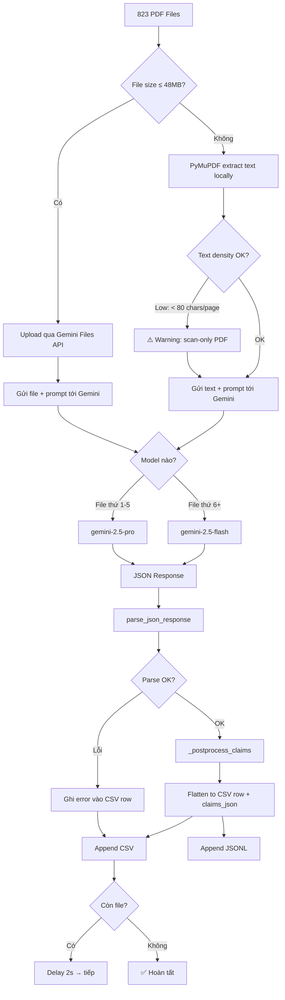

# Phân Tích Toàn Diện: Data Fields & Pipeline Trích Xuất ESG

> Tài liệu này mô tả **toàn bộ các fields** có trong dữ liệu gốc, lý do lấy/bỏ từng field, và giải thích chi tiết mọi thay đổi trong phase trích xuất ESG.

---

## Mục Lục

1. [Tổng quan dữ liệu gốc](#1-tổng-quan-dữ-liệu-gốc)
2. [Fields trong JSON metadata — Lấy gì, bỏ gì](#2-fields-trong-json-metadata)
3. [Fields bên trong PDF — Lấy gì, bỏ gì](#3-fields-bên-trong-pdf)
4. [Fields trong ESG100 CSV](#4-fields-trong-esg100-csv)
5. [Kiến trúc pipeline trích xuất (sau chỉnh sửa)](#5-kiến-trúc-pipeline-trích-xuất)
6. [Giải thích chi tiết prompt template](#6-giải-thích-prompt-template)
7. [Giải thích chi tiết extract script](#7-giải-thích-extract-script)
8. [CSV Output Schema — 40+ cột](#8-csv-output-schema)
9. [Danh sách file mới / đã sửa](#9-danh-sách-file)

---

## 1. Tổng quan dữ liệu gốc

Dữ liệu gồm **3 nguồn chính**:

| Nguồn | File | Mô tả | Số lượng |
|-------|------|--------|----------|
| **Report metadata** | [vietnam_reports.json](file:///d:/Github/RG_Greenwashing/data/vietnam_sustainabilityreports/vietnam_reports.json) | Thông tin từng báo cáo (crawl từ API) | 855 rows |
| **Company metadata** | [vietnam_companies.json](file:///d:/Github/RG_Greenwashing/data/vietnam_sustainabilityreports/vietnam_companies.json) | Thông tin công ty | 309 rows (gốc), hiện 1 row (đã filter) |
| **PDF files** | `data/.../pdfs/*.pdf` | Nội dung báo cáo thực tế | 823 files, 12.3 GB |
| **ESG100 benchmark** | [esg100_top100_2025.csv](file:///d:/Github/RG_Greenwashing/data/esg100_top100_2025.csv) | Top 100 DN Việt Nam theo ESG 2025 | 100 rows |

---

## 2. Fields trong JSON Metadata

### 2.1 vietnam_reports.json — 11 fields gốc

| # | Field | Ví dụ | Quyết định | Lý do |
|---|-------|-------|:---:|--------|
| 1 | `company_name` | `"DHG Pharmaceutical JSC"` | ✅ **LẤY** | Định danh công ty — cần cho mọi phân tích |
| 2 | `company_slug` | `"dhg-pharmaceutical"` | ✅ **LẤY** | Mapping file PDF (tên file dùng slug) |
| 3 | `company_isin` | `"VN000000DHG0"` | ✅ **LẤY** | Khóa nối (join key) giữa reports ↔ companies |
| 4 | `report_id` | `80006` | ✅ **LẤY** | Unique ID — cần cho mapping và resume |
| 5 | `report_year` | `2024` | ✅ **LẤY** | Phân tích xu hướng ESG theo năm |
| 6 | `report_type` | `"AR+"` / `"SR"` | ✅ **LẤY** | Phân loại ưu tiên xử lý (SR/IR > AR+  > AR) |
| 7 | `report_lang` | `"EN"` | ✅ **LẤY** | Routing xử lý ngôn ngữ |
| 8 | `report_title` | `"Annual Report"` | ⚠️ **TÙY** | Ít giá trị phân tích, nhưng hữu ích cho debug |
| 9 | `report_pages` | `115` | ✅ **LẤY** | Proxy cho độ chi tiết; dùng tính density |
| 10 | `report_filesize_mb` | `2.2` | ❌ **BỎ** | Không ảnh hưởng phân tích ESG |
| 11 | `pdf_url` | `"https://..."` | ❌ **BỎ** | Chỉ cần cho download, không cần cho analysis |

### 2.2 vietnam_companies.json — 9 fields gốc

| # | Field | Ví dụ | Quyết định | Lý do |
|---|-------|-------|:---:|--------|
| 1 | `company_key` | `"XSTC_DHG"` | ❌ **BỎ** | Internal key, không dùng cho phân tích |
| 2 | `company_name` | `"DHG Pharmaceutical JSC"` | ✅ **LẤY** | Đã có trong reports, dùng để verify |
| 3 | `company_ticker` | `"DHG"` | ✅ **LẤY** | Mã CK — để tra cứu và cross-ref với ESG100 |
| 4 | `company_isin` | `"VN000000DHG0"` | ✅ **LẤY** | Join key |
| 5 | `company_country` | `"Vietnam"` | ❌ **BỎ** | Luôn = "Vietnam" → không có thông tin |
| 6 | `company_sector` | `"Health Care"` | ✅ **LẤY** | So sánh ESG theo ngành — rất quan trọng |
| 7 | `company_slug` | `"dhg-pharmaceutical"` | ❌ **BỎ** | Đã có trong reports |
| 8 | `report_count` | `16` | ❌ **BỎ** | Có thể tự đếm từ reports JSON |
| 9 | `latest_report_year` | `2024` | ❌ **BỎ** | Có thể tự tính |

### 2.3 Cách pipeline sử dụng JSON metadata

Script [extract_esg_fields.py](file:///d:/Github/RG_Greenwashing/scripts/extract_esg_fields.py) sử dụng JSON metadata qua hàm [load_metadata()](file:///d:/Github/RG_Greenwashing/scripts/extract_esg_fields.py#80-113):

1. **Join** [vietnam_reports.json](file:///d:/Github/RG_Greenwashing/data/vietnam_sustainabilityreports/vietnam_reports.json) với [vietnam_companies.json](file:///d:/Github/RG_Greenwashing/data/vietnam_sustainabilityreports/vietnam_companies.json) qua `company_isin`
2. **Reconstruct filename** từ `slug + year + type + id` → [dhg-pharmaceutical_2024_AR+_80006.pdf](file:///d:/Github/RG_Greenwashing/data/vietnam_sustainabilityreports/pdfs/dhg-pharmaceutical_2024_AR+_80006.pdf)
3. **Enrich** mỗi report row với `company_ticker` và `company_sector` từ companies JSON
4. **Map** filename → metadata dict → ghi vào 8 cột đầu tiên của CSV output

---

## 3. Fields Bên Trong PDF — Lấy Gì, Bỏ Gì

Đây là phần **quan trọng nhất** — những gì Gemini API trích xuất từ nội dung PDF.

### 3.1 ✅ Fields CHẮC CHẮN LẤY (23 fields ESG)

#### Nhóm A: Frameworks & Standards (4 fields)

| Field output | Trích xuất như thế nào | Giá trị cho phân tích |
|-------------|-------------------------|----------------------|
| `gri_standards` | Gemini tìm mã GRI (VD: GRI 201, GRI 302) → comma-separated | Đo mức độ tuân thủ chuẩn quốc tế |
| `sdgs` | Tìm SDG 1–17 được nhắc → comma-separated | Cam kết phát triển bền vững |
| `frameworks` | Tìm mention GRI/TCFD/SASB/ISSB/UNGC/ISO14001 | Đa dạng framework = mature ESG |
| `external_assurance` | Tìm tên kiểm toán viên (PwC/KPMG/EY/Deloitte) | Có xác nhận độc lập = đáng tin |

#### Nhóm B: Dữ liệu Môi trường — Environmental (8 fields)

| Field output | Ý nghĩa | Vì sao lấy |
|-------------|---------|-------------|
| `ghg_scope1` | Phát thải trực tiếp (VD: `"15,000 tCO2e"`) | 🔑 Chỉ số cốt lõi greenwashing — so cam kết vs thực tế |
| `ghg_scope2` | Phát thải gián tiếp từ năng lượng | So sánh quy mô carbon footprint |
| `ghg_scope3` | Phát thải chuỗi giá trị | Ít DN công bố → nếu có = minh bạch cao |
| `total_energy_consumption` | Tổng năng lượng (kWh/MWh/GJ) | Tracking hiệu quả năng lượng |
| `renewable_energy_pct` | % năng lượng tái tạo | Cam kết chuyển đổi xanh |
| `water_consumption` | Tổng tiêu thụ nước (m³) | Quản lý tài nguyên |
| `total_waste` | Tổng chất thải (tonnes) | Kinh tế tuần hoàn |
| `waste_recycled_pct` | % chất thải tái chế | Chất lượng quản lý chất thải |

#### Nhóm C: Dữ liệu Xã hội — Social (6 fields)

| Field output | Ý nghĩa | Vì sao lấy |
|-------------|---------|-------------|
| `total_employees` | Tổng nhân viên | Baseline cho chỉ số per-capita |
| `female_employee_pct` | % nhân viên nữ | Đa dạng & hòa nhập (D&I) |
| `female_leadership_pct` | % nữ quản lý | Glass ceiling indicator |
| `training_hours_per_employee` | Giờ đào tạo/người | Đầu tư phát triển con người |
| `ltifr` | Tỷ lệ tai nạn lao động | An toàn lao động |
| `community_investment` | Đầu tư CSR (VND) | Trách nhiệm cộng đồng |

#### Nhóm D: Cam kết & Đánh giá (5 fields)

| Field output | Ý nghĩa | Vì sao lấy |
|-------------|---------|-------------|
| `has_net_zero_commitment` | `true`/`false` | Có cam kết Net Zero không |
| `net_zero_target_year` | VD: `"2050"` | Mục tiêu cụ thể hay chỉ hô hào |
| `key_esg_commitments` | Tóm tắt ≤500 ký tự | Bức tranh tổng quan cam kết |
| `vagueness_assessment` | `low`/`medium`/`high` | 🔑 **Chỉ số chính cho greenwashing** |
| `quantitative_data_richness` | `low`/`medium`/`high` | Mức độ minh bạch bằng số liệu |

### 3.2 ✅ Fields MỚI — Claim–Evidence System (6 fields mỗi claim)

Đây là **phần hoàn toàn mới** do bạn đã thêm vào prompt. Mỗi report trích xuất tối đa `MAX_CLAIMS` (mặc định 10) claims:

| Field | Type | Ý nghĩa | Vì sao cần |
|-------|------|---------|------------|
| `claim_id` | int | Số thứ tự claim | Định danh |
| `claim_summary` | str ≤400 chars | Tóm tắt claim bền vững | Nội dung claim để phân tích |
| `section_heading` | str | Tên chương/section trong PDF | Traceability — biết claim nằm ở đâu |
| `vagueness_piece` | `low`/`medium`/`high` | Đánh giá mơ hồ **từng claim** | Greenwashing detection chi tiết |
| `evidence_lines[]` | array of `{page, quote}` | Trích dẫn gốc + số trang | 🔑 **Bằng chứng traceable** — có thể verify lại |
| `claim_evidence_gap` | `none`/`low`/`medium`/`high` | Khoảng cách claim ↔ evidence | 🔑 **Phát hiện claim thiếu bằng chứng** |
| `gap_notes` | str ≤300 chars | Giải thích tại sao gap level như vậy | Context cho analyst |

> [!IMPORTANT]
> **Claim–evidence system** là điểm khác biệt lớn nhất so với bản gốc. Thay vì chỉ đánh giá vagueness ở mức toàn report, giờ đây mỗi claim riêng lẻ đều được đánh giá, kèm **trích dẫn nguyên văn từ PDF** và **số trang** để analyst có thể verify lại.

### 3.3 ❌ Nội dung PDF KHÔNG LẤY

| Nội dung | Lý do bỏ |
|----------|----------|
| Hình ảnh, đồ họa, logo | Gemini xử lý nhưng không cần trích ra CSV |
| Bảng BCTC thuần (lợi nhuận, doanh thu chi tiết) | Không liên quan ESG |
| Thông tin cổ đông, giao dịch cổ phiếu | Không liên quan |
| Headers, footers, page numbers | Noise |
| Lịch sử công ty, giới thiệu sản phẩm | Lặp lại mỗi năm, ít giá trị |
| PDF metadata (author, creator software) | Giá trị phân tích = 0 |
| Thư ngỏ CEO/Chairman (toàn văn) | Quá dài, chỉ cần tóm tắt qua `key_esg_commitments` |

---

## 4. Fields trong ESG100 CSV

File [esg100_top100_2025.csv](file:///d:/Github/RG_Greenwashing/data/esg100_top100_2025.csv) — dùng làm **benchmark** (không phải input cho pipeline):

| Field | Dùng cho |
|-------|---------|
| Tên DN / Mã CK / Ngành | Cross-reference với kết quả extraction |
| Ranking / ESG status | Benchmark: DN trong top 100 có ESG report tốt hơn không? |

---

## 5. Kiến Trúc Pipeline Trích Xuất (Sau Chỉnh Sửa)



### Thay đổi chính so với bản gốc:

| Đặc tính | Bản gốc (của tôi) | Bản hiện tại (sau chỉnh sửa) |
|----------|-------------------|-------------------------------|
| Model | Chỉ gemini-2.5-pro | **Dual-model**: pro cho N file đầu, flash cho phần còn lại → **tiết kiệm chi phí** |
| Output format | Chỉ CSV | CSV **+ JSONL** (claims là mảng JSON, không phải chuỗi) |
| Prompt | Trích xuất metrics | Metrics **+ claim–evidence** (trích dẫn + trang + gap assessment) |
| Config | `python-dotenv` trực tiếp | **Centralized** [config/settings.py](file:///d:/Github/RG_Greenwashing/config/settings.py) với typed getters |
| Error handling | Đơn giản (try/except) | Chi tiết: `extraction_status` (ok/partial/error/parse_error), `parse_error`, `api_finish_reason`, `prompt_block_reason` |
| Text extraction | Đơn giản | Thêm **diagnostics**: `truncated`, `low_text_density`, `chars_per_page_avg` |
| Boolean handling | Trực tiếp | [_coerce_bool()](file:///d:/Github/RG_Greenwashing/scripts/extract_esg_fields.py#185-200) — xử lý LLM trả "true"/"false" dạng string |

---

## 6. Giải Thích Chi Tiết Prompt Template

File: [esg_extraction_prompt.txt](file:///d:/Github/RG_Greenwashing/config/esg_extraction_prompt.txt)

### 3 nhiệm vụ chính của prompt:

| Task | Mô tả | Output |
|------|--------|--------|
| **(A)** Extract ESG metrics | Trích 23 fields (GRI, GHG, energy, water…) | Flat JSON fields |
| **(B)** Vagueness & richness assessment | Đánh giá mức mơ hồ và dữ liệu định lượng ở cấp toàn report | `vagueness_assessment`, `quantitative_data_richness` |
| **(C)** Claim–evidence analysis | Tìm tối đa `{{MAX_CLAIMS}}` claims, trích dẫn bằng chứng, đánh giá gap | `claims[]` array |

### Template variables:

| Variable | Giá trị mặc định | Mục đích |
|----------|------------------|---------|
| `{{MAX_CLAIMS}}` | 10 | Giới hạn số claims trích xuất — tránh output quá dài |
| `{{MAX_QUOTE_CHARS}}` | 500 | Giới hạn độ dài quote — tránh token cost quá cao |

### Rubric đánh giá (PROPOSED RUBRIC):

- **`vagueness_piece`** (per claim): `low` = mục tiêu định lượng cụ thể; `high` = chỉ "cam kết cải thiện"
- **`claim_evidence_gap`** (per claim): `none` = có bảng/số liệu hỗ trợ; `high` = không có bằng chứng
- **`vagueness_assessment`** (whole report): mức độ chung chung tổng thể
- **`quantitative_data_richness`** (whole report): mật độ số liệu

### Strict Rules quan trọng:

- Rule 2: **Không bịa số liệu**. `page` phải dùng PDF viewer page index (trang 1 = trang đầu tiên)
- Rule 3: Quote phải là **trích dẫn nguyên văn** ≤ `MAX_QUOTE_CHARS` ký tự
- Rule 7: Temperature = 0 → deterministic, ưu tiên "Not disclosed" hơn đoán

---

## 7. Giải Thích Chi Tiết Extract Script

File: [extract_esg_fields.py](file:///d:/Github/RG_Greenwashing/scripts/extract_esg_fields.py) — 771 dòng

### 7.1 Các hàm chính

| Hàm | Dòng | Chức năng |
|-----|------|-----------|
| [_ensure_repo_on_path()](file:///d:/Github/RG_Greenwashing/scripts/extract_esg_fields.py#30-35) | 30–34 | Thêm repo root vào `sys.path` để import `config.settings` |
| [load_metadata()](file:///d:/Github/RG_Greenwashing/scripts/extract_esg_fields.py#80-113) | 80–112 | Map filename → metadata (join reports + companies JSON) |
| [extract_text_locally()](file:///d:/Github/RG_Greenwashing/scripts/extract_esg_fields.py#115-157) | 115–156 | PyMuPDF extract text cho file >48MB; trả thêm **diagnostics** |
| [parse_json_response()](file:///d:/Github/RG_Greenwashing/scripts/extract_esg_fields.py#159-183) | 159–182 | Parse JSON từ LLM output; xử lý cả trường hợp LLM trả markdown |
| [_coerce_bool()](file:///d:/Github/RG_Greenwashing/scripts/extract_esg_fields.py#185-200) | 185–199 | Normalize bool — LLM đôi khi trả `"true"` (string) thay vì `true` (bool) |
| [_bool_to_csv()](file:///d:/Github/RG_Greenwashing/scripts/extract_esg_fields.py#202-209) | 202–208 | Chuyển bool → `"true"`/`"false"` cho CSV |
| [_response_debug()](file:///d:/Github/RG_Greenwashing/scripts/extract_esg_fields.py#211-236) | 211–235 | Extract debug info khi API trả response rỗng |
| [_append_jsonl()](file:///d:/Github/RG_Greenwashing/scripts/extract_esg_fields.py#238-242) | 238–241 | Ghi 1 dòng JSON vào file JSONL |
| [row_to_jsonl_record()](file:///d:/Github/RG_Greenwashing/scripts/extract_esg_fields.py#244-256) | 244–255 | Chuyển CSV row (claims_json = string) → JSON object (claims = array) |
| [_postprocess_claims()](file:///d:/Github/RG_Greenwashing/scripts/extract_esg_fields.py#258-289) | 258–288 | Validate + truncate claims: giới hạn số lượng, cắt quote dài |
| [build_prompt()](file:///d:/Github/RG_Greenwashing/scripts/extract_esg_fields.py#291-297) | 291–296 | Thay `{{MAX_CLAIMS}}` và `{{MAX_QUOTE_CHARS}}` trong template |
| [_genai_client()](file:///d:/Github/RG_Greenwashing/scripts/extract_esg_fields.py#299-311) | 299–310 | Tạo Gemini client; tránh SDK warning khi cả 2 API key env đều có |
| [process_pdf()](file:///d:/Github/RG_Greenwashing/scripts/extract_esg_fields.py#313-458) | 313–457 | 🔑 **Hàm chính** xử lý 1 PDF: upload/extract → call API → parse → row |
| [main()](file:///d:/Github/RG_Greenwashing/scripts/extract_esg_fields.py#460-767) | 460–770 | Orchestration: args, config, loop, CSV/JSONL write, resume logic |

### 7.2 Dual-Model Strategy

```python
# Dòng 703–706
model_name = (
    args.model_pro          # gemini-2.5-pro (mạnh, đắt)
    if processed_idx < args.sample_pro_n   # N file đầu tiên (mặc định 5)
    else args.model_batch   # gemini-2.5-flash (nhanh, rẻ)
)
```

**Lý do**: 
- **Pro** chính xác hơn nhưng **đắt gấp ~10x**
- Chạy **5 file đầu bằng pro** để kiểm tra chất lượng prompt
- Nếu kết quả OK → **phần còn lại dùng flash** để tiết kiệm
- Có thể override qua `--model-pro`, `--model-batch`, `--sample-pro-n`

### 7.3 Diagnostics Columns (MỚI)

| Column | Khi nào có giá trị | Ý nghĩa |
|--------|---------------------|---------|
| `model_used` | Luôn | Model nào xử lý file này |
| `extraction_status` | Luôn | `ok` / `partial` / `error` / `parse_error` |
| `parse_error` | Khi lỗi | Chi tiết lỗi (VD: `"empty_model_response"`) |
| `metadata_in_lookup` | Luôn | PDF có match trong reports JSON không |
| `text_extraction_mode` | Luôn | `"upload"` (Files API) hoặc `"local"` (PyMuPDF) |
| `local_truncated` | Khi mode=local | Text bị cắt vì quá dài (>800K chars) |
| `local_low_text_density` | Khi mode=local | <80 chars/trang → PDF scan/image-heavy |
| `chars_per_page_avg` | Khi mode=local | Trung bình ký tự/trang |
| `api_finish_reason` | Khi response rỗng | Lý do API kết thúc (VD: safety filter) |
| `prompt_block_reason` | Khi bị block | Prompt bị chặn bởi safety policy |

### 7.4 JSONL Output (MỚI)

- Mặc định **bật** (`GEMINI_WRITE_JSONL=true`)
- File `.jsonl` cùng tên với CSV
- Mỗi dòng = 1 JSON object đầy đủ, [claims](file:///d:/Github/RG_Greenwashing/scripts/extract_esg_fields.py#258-289) là **array** (không phải string)
- **Dễ load hơn CSV** cho phân tích claims downstream

### 7.5 Retry Logic

```
Retry tối đa 3 lần, nhưng:
- parse_error → KHÔNG retry (lỗi logic, retry vô ích)
- ok / partial → DỪNG (đã thành công)
- error → RETRY (lỗi API/network, có thể tự khỏi)
```

### 7.6 Centralized Config — [config/settings.py](file:///d:/Github/RG_Greenwashing/config/settings.py)

File [settings.py](file:///d:/Github/RG_Greenwashing/config/settings.py) cung cấp:

| Hàm | Mô tả |
|-----|--------|
| [load_env()](file:///d:/Github/RG_Greenwashing/config/settings.py#15-26) | Load [.env](file:///d:/Github/RG_Greenwashing/config/.env) (ưu tiên [config/.env](file:///d:/Github/RG_Greenwashing/config/.env) trước `repo/.env`) |
| [get_str()](file:///d:/Github/RG_Greenwashing/config/settings.py#28-33), [get_int()](file:///d:/Github/RG_Greenwashing/config/settings.py#35-40), [get_float()](file:///d:/Github/RG_Greenwashing/config/settings.py#42-47), [get_bool()](file:///d:/Github/RG_Greenwashing/config/settings.py#49-54) | Typed getters với default |
| [get_path()](file:///d:/Github/RG_Greenwashing/config/settings.py#56-66) | Trả `Path`, auto-resolve relative path theo repo root |
| [get_int_optional()](file:///d:/Github/RG_Greenwashing/config/settings.py#68-73), [get_path_optional()](file:///d:/Github/RG_Greenwashing/config/settings.py#75-83) | Trả `None` nếu không set |

**Lợi ích**: Tất cả giá trị mặc định nằm ở **một nơi** ([config/.env.example](file:///d:/Github/RG_Greenwashing/config/.env.example)), thay vì hardcode rải rác trong script.

---

## 8. CSV Output Schema — 40+ Cột

### Nhóm 1: Metadata (8 cột) — từ JSON

| Cột | Nguồn |
|-----|-------|
| `pdf_filename` | Tên file PDF |
| `company_name` | reports.json |
| `company_ticker` | companies.json |
| `company_sector` | companies.json |
| `report_year` | reports.json |
| `report_type` | reports.json |
| `report_lang` | reports.json |
| `report_pages` | reports.json |

### Nhóm 2: Diagnostics (10 cột) — từ script

| Cột | Mô tả |
|-----|--------|
| `model_used` | `gemini-2.5-pro` hoặc `gemini-2.5-flash` |
| `extraction_status` | `ok` / `partial` / `error` / `parse_error` |
| `parse_error` | Chi tiết lỗi |
| `metadata_in_lookup` | PDF có trong reports JSON |
| `text_extraction_mode` | `upload` / [local](file:///d:/Github/RG_Greenwashing/scripts/extract_esg_fields.py#115-157) |
| `local_truncated` | Text bị cắt |
| `local_low_text_density` | PDF scan/image |
| `chars_per_page_avg` | Chars/page trung bình |
| `api_finish_reason` | API finish reason |
| `prompt_block_reason` | Safety block reason |

### Nhóm 3: ESG Fields (23 cột) — từ Gemini

*(Chi tiết ở Section 3.1 phía trên)*

| Cột | Type |
|-----|------|
| `gri_standards` | comma-separated |
| `sdgs` | comma-separated |
| `frameworks` | comma-separated |
| `external_assurance` | string |
| `ghg_scope1` – `ghg_scope3` | string (value+unit) |
| `total_energy_consumption` | string |
| `renewable_energy_pct` | string |
| `water_consumption` | string |
| `total_waste` | string |
| `waste_recycled_pct` | string |
| `total_employees` – `community_investment` | string |
| `has_net_zero_commitment` | `true`/`false` |
| `net_zero_target_year` | string |
| `key_esg_commitments` | string ≤500 chars |
| `vagueness_assessment` | `low`/`medium`/`high` |
| `quantitative_data_richness` | `low`/`medium`/`high` |

### Nhóm 4: Claims (1 cột trong CSV, array trong JSONL)

| Cột CSV | Nội dung |
|---------|---------|
| `claims_json` | JSON string chứa mảng claims (xem Section 3.2) |

**Tổng: 42 cột CSV** + 1 cột `claims_json` chứa structured data.

---

## 9. Danh Sách File Mới / Đã Sửa

| File | Status | Mô tả |
|------|--------|-------|
| [extract_esg_fields.py](file:///d:/Github/RG_Greenwashing/scripts/extract_esg_fields.py) | 🔄 Đã sửa lớn | Script chính — 771 dòng (gốc ~200 dòng) |
| [esg_extraction_prompt.txt](file:///d:/Github/RG_Greenwashing/config/esg_extraction_prompt.txt) | 🔄 Đã sửa lớn | Prompt template — thêm claim–evidence |
| [settings.py](file:///d:/Github/RG_Greenwashing/config/settings.py) | 🆕 Mới | Centralized config module |
| [.env.example](file:///d:/Github/RG_Greenwashing/config/.env.example) | 🆕 Mới | Reference cho tất cả biến env |
| [__init__.py](file:///d:/Github/RG_Greenwashing/config/__init__.py) | 🆕 Mới | Biến config thành Python package |
| [requirements.txt](file:///d:/Github/RG_Greenwashing/requirements.txt) | 🔄 Đã sửa | Thêm google-genai, pymupdf, python-dotenv |
| [.env](file:///d:/Github/RG_Greenwashing/config/.env) | 🔄 Đã sửa | Thêm GEMINI_API_KEY + tất cả config |
